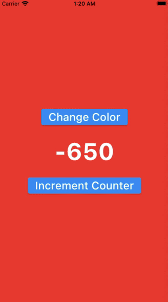

&nbsp;&nbsp;
&nbsp;&nbsp;
<a href="https://choosealicense.com/licenses/mit/" target="_blank"></a>&nbsp;&nbsp;
&nbsp;&nbsp;


# BLoC Tutorial

</img>

In the [Flutter Bloc Essential](https://www.udemy.com/course/flutter-bloc-essential-course-english/) course, you can learn in depth about Bloc, the popular Flutter state management solutions.

In particular, it covers only the most recent version, version 8.0 or higher.

If you want to deepen your understanding of the Flutter Bloc and put all the concepts into practice, then this course is for you.

The lecture was carefully composed to ensure a balance between theory and practice.

And under the belief that repetition is the most important learning method, whenever there is a new concept, we will test the concept by making a small app, and through real-world apps such as TODO, Weather, and Firebase Authentication app, the concepts will come together comprehensively.

## BLoC Overview

Few common widgets from the `flutter_bloc` package:

### 1. BlocBuilder

```dart
BlocBuilder<BlocA, BlocAState>(
    bloc: blocA,  // provide the local bloc instance
    buildWhen: (previousState, state){
        // return true/false to determine whether or not
        // to rebuild the widget with state
    },
    builder:(context, state){
        // return widget here based on BlocA's state
    }
)
```

### 2. BlocListener

```dart
BlocListener<BlocA, BlocAState>(
    bloc: blocA,  // provide the local bloc instance
    listenWhen: (previousState, state){
        // return true/false to determine whether or not
        // to call listener with state
    },
    listener:(context, state){
        // do stuff here based on BlocA's state
    },
    child: Container(),
)
```

### 3. BlocConsumer

It is the combination of `BlocBuilder` & `BlocListener`

```dart
BlocConsumer<BlocA, BlocAState>(
    bloc: blocA,  // provide the local bloc instance
    listenWhen: (previousState, current){
        // return true/false to determine whether or not
        // to call listener with state
    },
    listener:(context, state){
        // do stuff here based on BlocA's state
    },
    buildWhen: (previousState, current){
        // return true/false to determine whether or not
        // to rebuild the widget with state
    },
    builder:(BuildContext context, BlocAState state){
        // return widget here based on BlocA's state
    }
)
```

### 4. Extension methods on BuildContext

When we needed to use multiple states at the same time, then we should use these extensions for code readability.

```text
    ◉ context.watch<T>(), which makes the widget listen to change on T
    ◉ context.read<T>(), which returns T without listening to it
    ◉ context.select<T, R>(R cb(T value)), which allows a widget to listen
      to only a small part of T.
```

```dart
    BlocProvider.of<T>(context) = context.read<T>()
    BlocProvider.of<T>(context, listen: true) = context.watch<T>()
```

### 5. Process of creating a STATE

```
 Process of creating an state:
    1. create ClassState
    2. create variable
    3. Generate `Constrictor`
    4. ClassState `extends` Equatable
    5. Generate `Equitable`
    6. Generate `toString()`
    7. Generate `copyWith()`
    8. write `factory` contactor (i.e. CounterState.initial())
```

### 6. Cubit_2_Cubit & Bloc_2_Bloc Communication

**_Cubit to Cubit_** & **_Bloc to Bloc_** communication can be developed using:

```text
    ◉ cubit + StreamSubscription
    ◉ cubit + BlocListener
    ◉ bloc + StreamSubscription
    ◉ bloc + BlocListener
```

### 7. Routing using Bloc

```text
    1. Anonymous Route Access
    2. Named Route Access
    3. Generated Route Access
```

### 8. Observing CubitBlocs

<table align="center" style="margin: 0px auto;">
  <tr>
    <td></img></td>
  </tr>
</table>

### 9. Bloc Observer Template

```dart
import 'package:bloc/bloc.dart';

class CounterBlocObserver extends BlocObserver {
  @override
  void onEvent(Bloc bloc, Object? event) {
    super.onEvent(bloc, event);
    print('ColorBlocObserver(event): ${bloc.runtimeType}, $event');
  }

  @override
  void onError(BlocBase bloc, Object error, StackTrace stackTrace) {
    print('ColorBlocObserver(error): ${bloc.runtimeType}, $error, $stackTrace');
    super.onError(bloc, error, stackTrace);
  }

  @override
  void onChange(BlocBase bloc, Change change) {
    super.onChange(bloc, change);
    print('ColorBlocObserver(change): ${bloc.runtimeType}, $change');
  }

  @override
  void onTransition(Bloc bloc, Transition transition) {
    super.onTransition(bloc, transition);
    print('ColorBlocObserver(transition): ${bloc.runtimeType}, $transition');
  }
}
```

How to implement it in the main function?

```dart
void main() {
  /// this [Bloc.observer] is only of `debugging` purpose
  ///
  Bloc.observer = ColorBlocObserver();

  runApp(const MyApp());
}
```

### 10. Event Transformation


Bloc 7.2.0 and Bloc 8.0.0 introduce a new way to register event handlers. With this change comes several benefits, including reduced boilerplate, better consistency with cubit, and, most of all, concurrent event processing — by default!

Note: Read the detailed documentation of [Event Transformation](https://verygood.ventures/blog/how-to-use-bloc-with-streams-and-concurrency)


## App Screenshots

<table align="center" style="margin: 0px auto;">
  <tr>
    <th>Folder No.</th>
    <th>Name of the App</th>
    <th>Logic Files</th>
    <th>Screenshots</th>
  </tr>
  <tr>
    <td align="center">2</td>
    <td><a href="lib/2_bloc_overview/1_counter_using_cubit/main_counter_cubit.dart">Counter Using Cubit</a></td>
    <td>
      <a href="lib/2_bloc_overview/1_counter_using_cubit/cubit/counter_cubit.dart">counter_cubit.dart</a><br>
      <a href="lib/2_bloc_overview/1_counter_using_cubit/cubit/counter_state.dart">counter_state.dart</a>
    </td>
    <td></img></td>
  </tr>
  <tr>
    <td align="center">2</td>
    <td><a href="lib/2_bloc_overview/2_counter_using_bloc/main_counter_bloc.dart">Counter Using Bloc</a></td>
    <td>
      <a href="lib/2_bloc_overview/2_counter_using_bloc/blocs/counter/counter_bloc.dart">counter_bloc.dart</a><br>
      <a href="lib/2_bloc_overview/2_counter_using_bloc/blocs/counter/counter_event.dart">counter_event.dart</a><br>
      <a href="lib/2_bloc_overview/2_counter_using_bloc/blocs/counter/counter_state.dart">counter_state.dart</a>
    </td>
    <td></img></td>
  </tr>
  <tr>
    <td align="center">2</td>
    <td><a href="lib/2_bloc_overview/3_bloc_payload/main_bloc_payload.dart">Bloc Payload</a></td>
    <td>
      <a href="lib/2_bloc_overview/3_bloc_payload/bloc/theme_bloc.dart">theme_bloc.dart</a><br>
      <a href="lib/2_bloc_overview/3_bloc_payload/bloc/theme_event.dart">theme_event.dart</a><br>
      <a href="lib/2_bloc_overview/3_bloc_payload/bloc/theme_state.dart">theme_state.dart</a>
    </td>
    <td></img></td>
  </tr>
  <tr>
    <td align="center">2</td>
    <td><a href="lib/2_bloc_overview/4_cubit_payload/main_cubit_payload.dart">Cubit Payload</a></td>
    <td>
      <a href="lib/2_bloc_overview/4_cubit_payload/cubit/theme_cubit.dart">theme_cubit.dart</a><br>
      <a href="lib/2_bloc_overview/4_cubit_payload/cubit/theme_state.dart">theme_state.dart</a>
    </td>
    <td></img></td>
  </tr>
  <tr>
    <td align="center">2</td>
    <td><a href="lib/2_bloc_overview/5_cubit_2_cubit/main_cubit_to_cubit.dart">Cubit 2 Cubit</a></td>
    <td>
      <a href="lib/2_bloc_overview/5_cubit_2_cubit/cubit/color/color_cubit.dart">color_cubit.dart</a><br>
      <a href="lib/2_bloc_overview/5_cubit_2_cubit/cubit/color/color_state.dart">color_state.dart</a><br>
      <a href="lib/2_bloc_overview/5_cubit_2_cubit/cubit/counter/counter_cubit.dart">counter_cubit.dart</a><br>
      <a href="lib/2_bloc_overview/5_cubit_2_cubit/cubit/counter/counter_state.dart">counter_state.dart</a>
    </td>
    <td></img></td>
  </tr>
  <tr>
    <td align="center">2</td>
    <td><a href="lib/2_bloc_overview/6_cubit_2_cubit_listener/main_cubit_to_cubit_listener.dart">Cubit 2 Cubit Listener</a></td>
    <td>
      <a href="lib/2_bloc_overview/6_cubit_2_cubit_listener/cubit/color/color_cubit.dart">color_cubit.dart</a><br>
      <a href="lib/2_bloc_overview/6_cubit_2_cubit_listener/cubit/color/color_state.dart">color_state.dart</a><br>
      <a href="lib/2_bloc_overview/6_cubit_2_cubit_listener/cubit/counter/counter_cubit.dart">counter_cubit.dart</a><br>
      <a href="lib/2_bloc_overview/6_cubit_2_cubit_listener/cubit/counter/counter_state.dart">counter_state.dart</a>
    </td>
    <td></img></td>
  </tr>
  <tr>
    <td align="center">2</td>
    <td><a href="lib/2_bloc_overview/7_bloc_2_bloc/main_bloc_to_bloc.dart">Bloc 2 Bloc</a></td>
    <td>
      <a href="lib/2_bloc_overview/7_bloc_2_bloc/blocs/color/color_bloc.dart">color_bloc.dart</a><br>
      <a href="lib/2_bloc_overview/7_bloc_2_bloc/blocs/color/color_event.dart">color_event.dart</a><br>
      <a href="lib/2_bloc_overview/7_bloc_2_bloc/blocs/color/color_state.dart">color_state.dart</a><br>
      <a href="lib/2_bloc_overview/7_bloc_2_bloc/blocs/counter/counter_bloc.dart">counter_bloc.dart</a><br>
      <a href="lib/2_bloc_overview/7_bloc_2_bloc/blocs/counter/counter_event.dart">counter_event.dart</a><br>
      <a href="lib/2_bloc_overview/7_bloc_2_bloc/blocs/counter/counter_state.dart">counter_state.dart</a>
    </td>
    <td></img></td>
  </tr>
  <tr>
    <td align="center">2</td>
    <td><a href="lib/2_bloc_overview/7_bloc_2_bloc/main_bloc_to_bloc.dart">Bloc 2 Bloc Listener</a></td>
    <td>
      <a href="lib/2_bloc_overview/8_bloc_2_bloc_listener/blocs/color/color_bloc.dart">color_bloc.dart</a><br>
      <a href="lib/2_bloc_overview/8_bloc_2_bloc_listener/blocs/color/color_event.dart">color_event.dart</a><br>
      <a href="lib/2_bloc_overview/8_bloc_2_bloc_listener/blocs/color/color_state.dart">color_state.dart</a><br>
      <a href="lib/2_bloc_overview/8_bloc_2_bloc_listener/blocs/counter/counter_bloc.dart">counter_bloc.dart</a><br>
      <a href="lib/2_bloc_overview/8_bloc_2_bloc_listener/blocs/counter/counter_event.dart">counter_event.dart</a><br>
      <a href="lib/2_bloc_overview/8_bloc_2_bloc_listener/blocs/counter/counter_state.dart">counter_state.dart</a>
    </td>
    <td></img></td>
  </tr>
  <tr>
    <td align="center">2</td>
    <td><a href="lib/2_bloc_overview/1_counter_using_cubit/main_counter_cubit.dart">Bloc Context</a></td>
    <td>
      <a href="lib/2_bloc_overview/9_bloc_context/cubit/counter_cubit.dart">counter_cubit.dart</a><br>
      <a href="lib/2_bloc_overview/9_bloc_context/cubit/counter_state.dart">counter_state.dart</a>
    </td>
    <td></img></td>
  </tr>
  <tr>
    <td align="center">2</td>
    <td><a href="lib/2_bloc_overview/10_bloc_anonymous/main_bloc_anonymous.dart">Bloc Anonymous</a></td>
    <td>
      <a href="lib/2_bloc_overview/10_bloc_anonymous/cubit/counter_cubit.dart">counter_cubit.dart</a><br>
      <a href="lib/2_bloc_overview/10_bloc_anonymous/cubit/counter_state.dart">counter_state.dart</a>
    </td>
    <td></img></td>
  </tr>
  <tr>
    <td align="center">2</td>
    <td><a href="lib/2_bloc_overview/11_bloc_named/main_bloc_named.dart">Bloc Named</a></td>
    <td>
      <a href="lib/2_bloc_overview/11_bloc_named/cubit/counter_cubit.dart">counter_cubit.dart</a><br>
      <a href="lib/2_bloc_overview/11_bloc_named/cubit/counter_state.dart">counter_state.dart</a>
    </td>
    <td></img></td>
  </tr>
  <tr>
    <td align="center">2</td>
    <td><a href="lib/2_bloc_overview/12_bloc_generated/main_bloc_generated.dart">Bloc Generated</a></td>
    <td>
      <a href="lib/2_bloc_overview/12_bloc_generated/cubit/counter_cubit.dart">counter_cubit.dart</a><br>
      <a href="lib/2_bloc_overview/12_bloc_generated/cubit/counter_state.dart">counter_state.dart</a>
    </td>
    <td></img></td>
  </tr>
  <tr>
    <td align="center">2</td>
    <td><a href="lib/2_bloc_overview/13_bloc_2_bloc/main_bloc_to_bloc.dart">Bloc 2 Bloc</a></td>
    <td>
      <a href="lib/2_bloc_overview/13_bloc_2_bloc/observers/color_bloc_observer.dart">color_bloc_observer.dart</a><br>
      <a href="lib/2_bloc_overview/13_bloc_2_bloc/observers/counter_bloc_observer.dart">counter_bloc_observer.dart</a>
    </td>
    <td></img></td>
  </tr>
</table>
